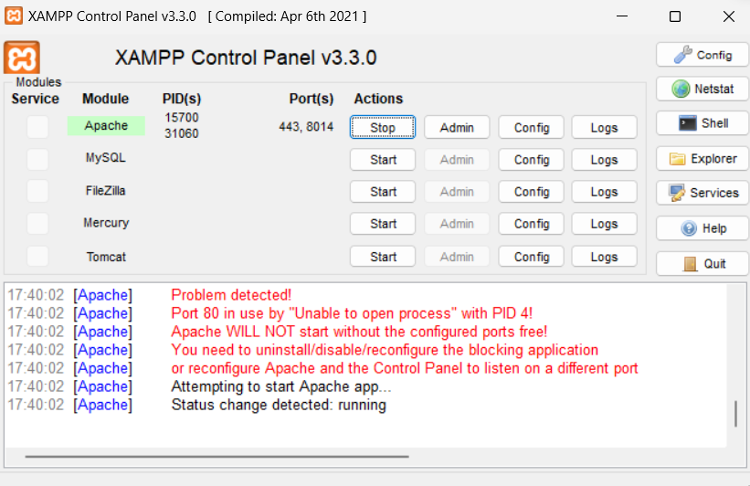
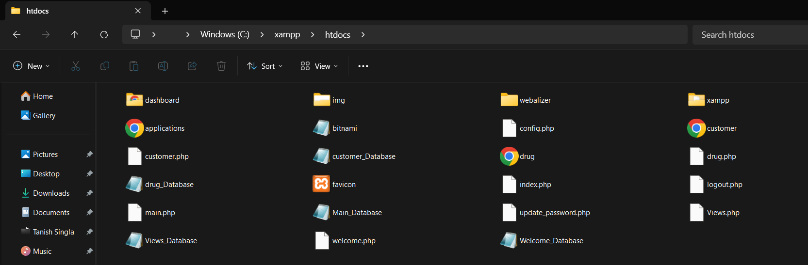
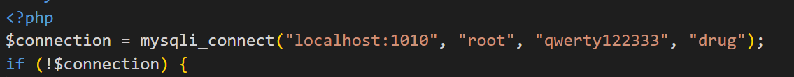
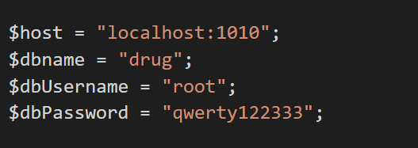
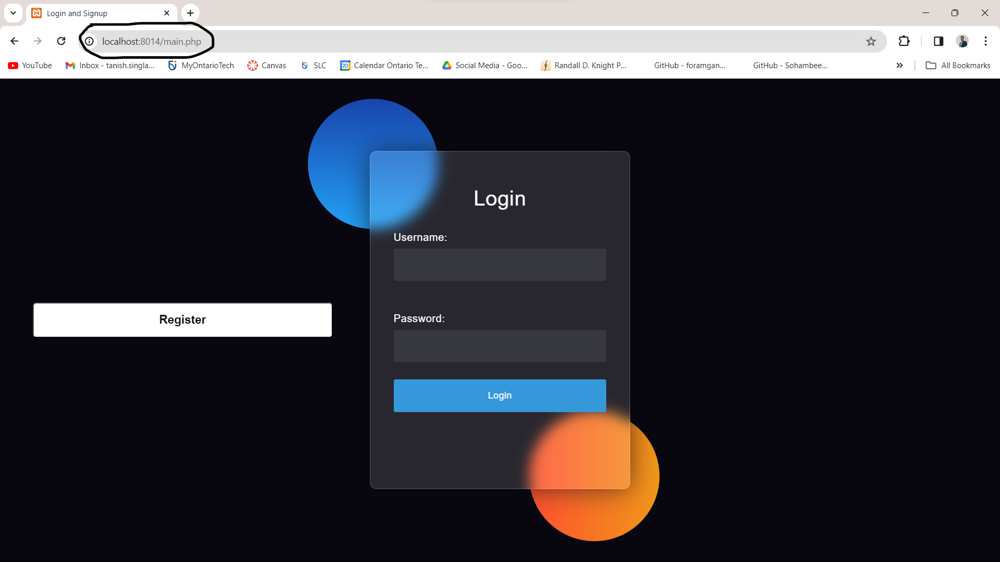

# Project Setup

## Required Software

1. **XAMPP Server**
2. **MySQL WORKBENCH BACKEND**
3. **PHP Frontend**
4. **Windows System with Active Internet.**

## Setup and Installation

### MySQL Workbench Setup

1. Open Mysql Workbench and create a new database of the name 'drug'.
2. Navigate to the GitHub Phase-II folder and start by using the create commands. Run each table individually as they have dependencies.
3. Run the Populate Commands. Similarly, run these individually due to dependencies.
4. Run the Create_Views commands to ensure your views exist.

### XAMPP Server Installation

1. Install XAMPP Server and ensure that Apache can run on the same.
2. Copy all the files from the Phase-III folder to the `htdocs` folder in your XAMPP installation.
   
   

### Configuration

1. Open the following files from the copied Phase-III files and replace the username and password with your MySQL credentials. Ensure the localhost port and database name are correct:

   - `config.php`
   - `views.php`
   - `drug.php`
   - `customer.php`
   - `update_password.php`
     This is where the changes made should be for reference:
     
     

### Startup

1. Go to your browser and start the localhost:{the port number you used in apache}/main.php
   
2. Then you are free to navigate through the webpage and see changes to the backend too.

Make sure to follow these steps meticulously to set up the project successfully. If you encounter any issues during the installation or configuration process,please contact me through email (tanish.singla@ontariotechu.net).

### Debug Possible Errors

1. Failure to establish a connection with Workbench. Ensure your credentials work properly.
2. Incorrect port number in Apache. Verify that the port number in the URL matches the one configured in Apache.
3. File permission issues in the `htdocs` folder. Make sure the web server has the necessary permissions to access the files.
4. Incorrect database name in the configuration files. Double-check the database name specified in `config.php` and ensure it matches the one created in MySQL Workbench.
5. PHP module not enabled in Apache. Ensure that the PHP module is enabled in the Apache configuration.
